## 空间同步

### 坐标系定义

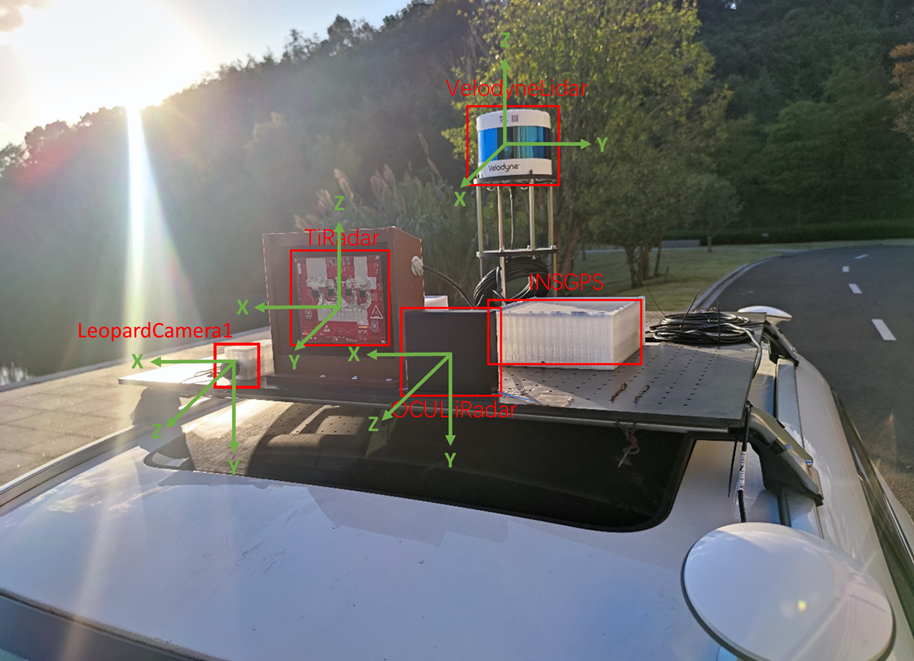

LeopardCamera1坐标系，右手系，z轴向前

VelodyneLidar坐标系，右手系，x指向正前方

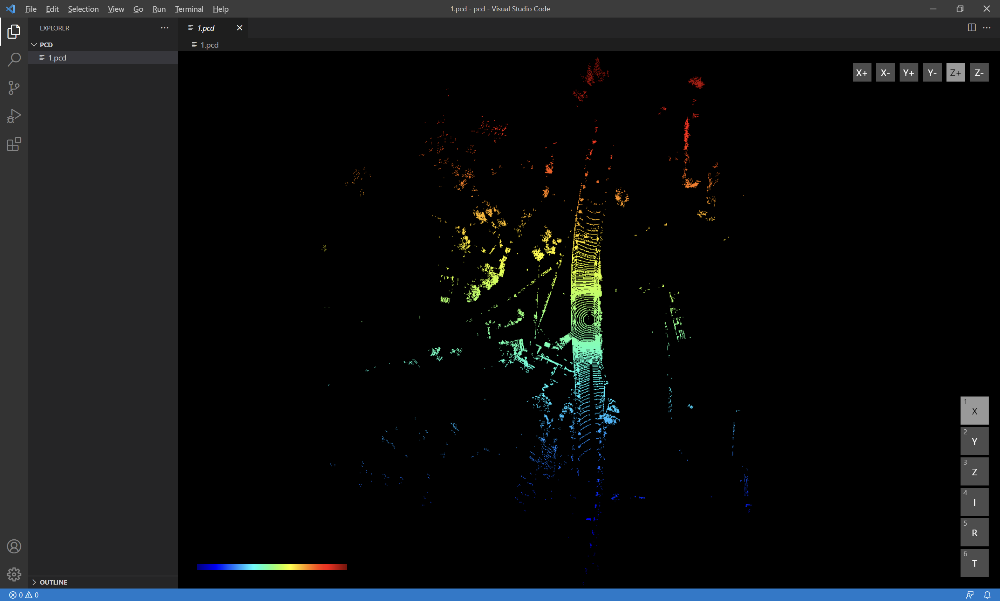

（官方坐标系，右手系，y指向正前方）

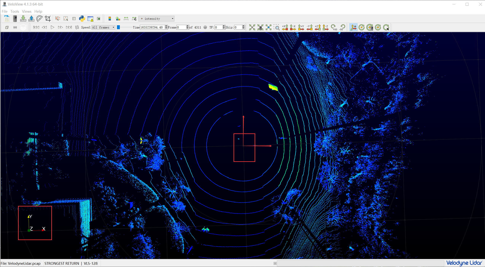

OCULiiRadar坐标系，右手系，z轴向前

TIRadar坐标系，右手系，y轴向前

### LeopardCamera1内参标定

```matlab
IntrinsicMatrix = 
1976.27129878769	0	1798.25228491297
0	1977.80114435384	1000.96808764067
0	0	1
```

### TIRadar与LeopardCamera1标定

回归初始值

```matlab
% 外参矩阵求解参数
x=[sym('thetax');sym('thetay');sym('thetaz');sym('tx');sym('ty');sym('tz')]; %定义函数变量 x，共6个变量，x(1)~x(6)（double float）

% 外参初值的设置很关键，影响结果是否能正常收敛
xk=[-pi/2;0;0;0;0;0];
```


剔除6/8/17

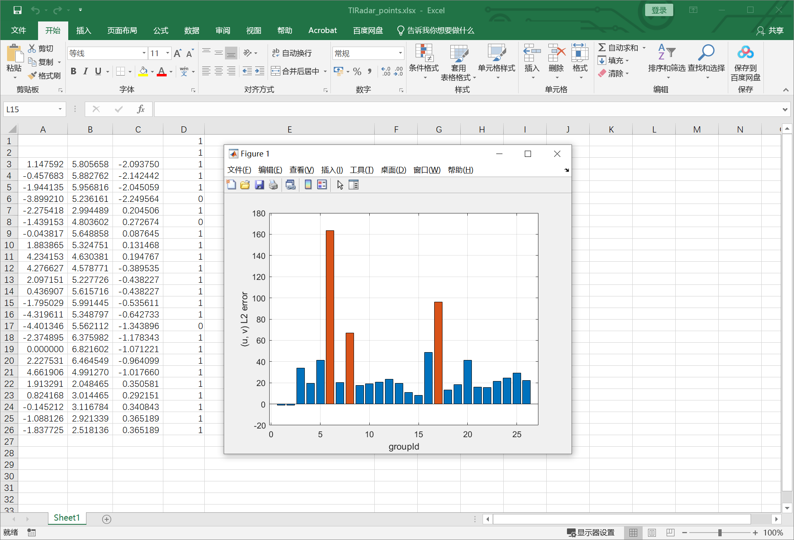

再剔除3/5/16/20

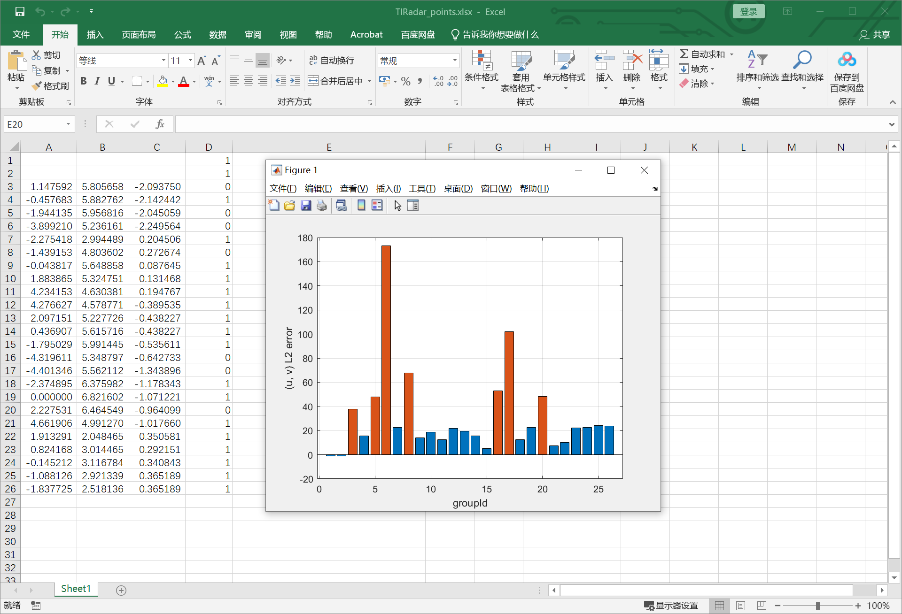

```matlab
TIRadar_to_LeopardCamera1_TransformMatrix = 
2019.61363529422	1745.88166828988	-111.433796801951	-419.938881768377
26.0193673714885	870.796981112031	-2038.30078479358	-120.997110351106
0.0244308479903333	0.997614077965117	-0.0645700016438225	-0.00641535834610336

xyz1=[xyz;ones(1,size(xyz,2))];
uv1=TIRadar_to_LeopardCamera1_TransformMatrix * xyz1 * (diag(1./([0,0,1] * TIRadar_to_LeopardCamera1_TransformMatrix * xyz1)));
uv=uv1(1:2, :);
uv = round(uv);
```

### OCULiiRadar与LeopardCamera1标定

回归初始值

```matlab
% 外参矩阵求解参数
x=[sym('thetax');sym('thetay');sym('thetaz');sym('tx');sym('ty');sym('tz')]; %定义函数变量 x，共6个变量，x(1)~x(6)（double float）

% 外参初值的设置很关键，影响结果是否能正常收敛
xk=[0;0;0;0;0;0];
```

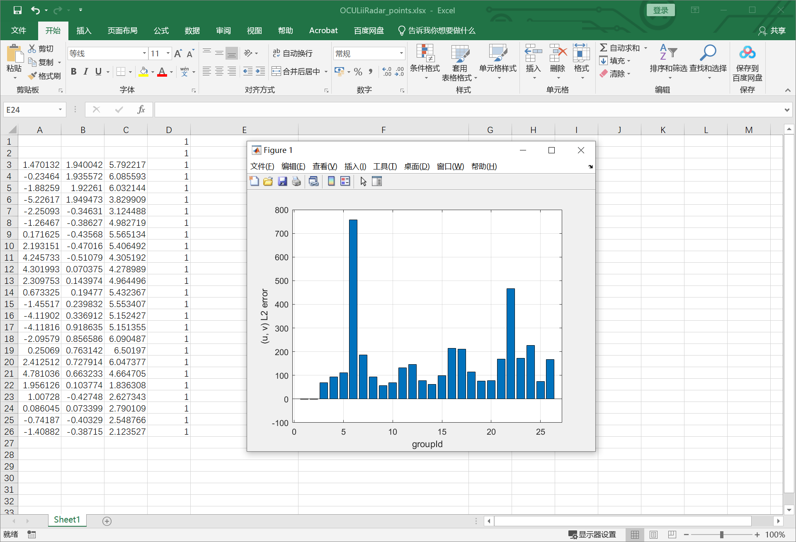

剔除6/7/16/17/22/24

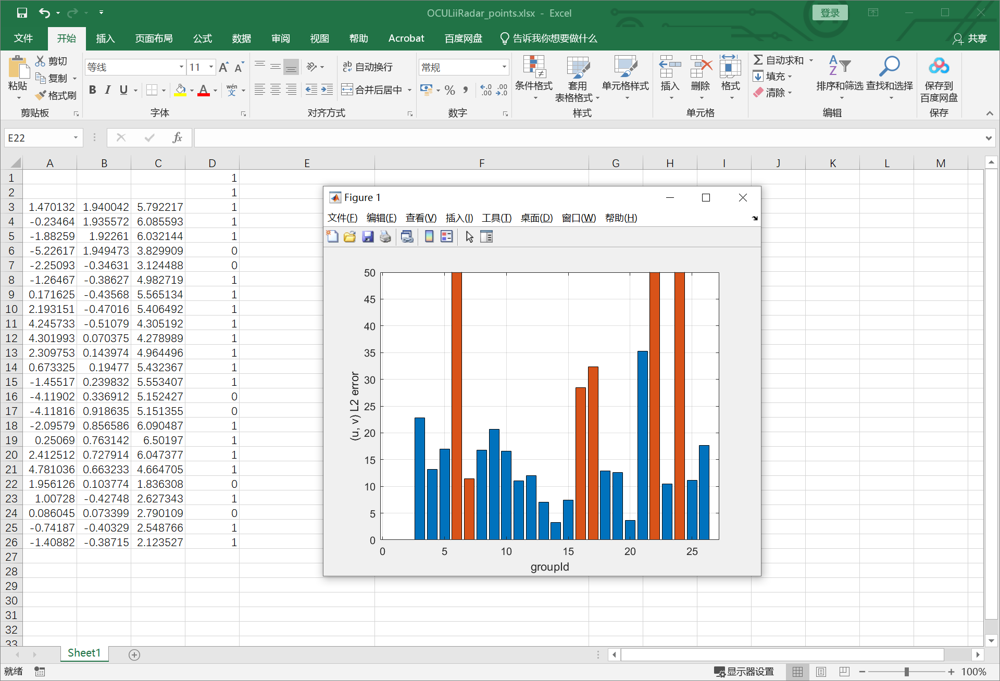

```matlab
OCULiiRadar_to_LeopardCamera1_TransformMatrix = 
2018.42644534508	-13.1493216485269	1750.75449640391	-697.760823541407
66.2659657147056	1993.67325005292	966.700715264912	-23.9375286906592
0.0240097573054129	0.0165966033348199	0.999573951397235	0.101356358170842

xyz1=[xyz;ones(1,size(xyz,2))];
uv1=OCULiiRadar_to_LeopardCamera1_TransformMatrix * xyz1 * (diag(1./([0,0,1] * OCULiiRadar_to_LeopardCamera1_TransformMatrix * xyz1)));
uv=uv1(1:2, :);
uv = round(uv);
```

### VelodyneLidar与LeopardCamera1标定

```matlab
% VelodyneLidar官方坐标系
Rotation = 
0.999018744528412	0.0166245599949506	-0.0410508475655524
0.0413620011242212	-0.0188262903381298	0.998966844122018
0.0158345490581776	-0.999684547643445	-0.0194954420069267

Translation = 
-0.265290406655631	-0.391122231870622	-0.515288952567310

transformMatrix = [Rotation' Translation']
0.999018744528412	0.0413620011242212	0.0158345490581776	-0.265290406655631
0.0166245599949506	-0.0188262903381298	-0.999684547643445	-0.391122231870622
-0.0410508475655524	0.998966844122018	-0.0194954420069267	-0.515288952567310

IntrinsicMatrix = 
1976.27129878769	0	1798.25228491297
0	1977.80114435384	1000.96808764067
0	0	1

xyz = pcd.Location;
xyz1 = [xyz'; ones(1, size(xyz,1))];
UVZ = intrinsicsMatrix * transformMatrix * xyz1;
uv1 = UVZ ./ UVZ(3, :);
uv = uv1(1:2, :)';

VelodyneLidar_to_LeopardCamera1_TransformMatrix = intrinsicsMatrix * transformMatrix
1900.51229133004	1878.13694567694	-3.76435830142225	-1450.90535286182
-8.21051460132721	962.699273002558	-1996.69155762544	-1289.34979520961
-0.0410508475655524	0.998966844122018	-0.0194954420069267	-0.515288952567310

% VelodyneLidar自测坐标系
mycoordinate_to_officialcoordinate_transformMatrix = 
0	-1	0	0
1	0	0	0
0	0	1	0
0	0	0	1

Rotation_new = (Rotation' * mycoordinate_to_officialcoordinate_transformMatrix(1:3, 1:3))'
0.0413620011242213	-0.0188262903381298	0.998966844122018
-0.999018744528412	-0.0166245599949506	0.0410508475655525
0.0158345490581776	-0.999684547643445	-0.0194954420069267

Translation = 
-0.265290406655631	-0.391122231870622	-0.515288952567310

transformMatrix = [Rotation_new' Translation']
0.0413620011242213	-0.999018744528412	0.0158345490581776	-0.265290406655631
-0.0188262903381298	-0.0166245599949506	-0.999684547643445	-0.391122231870622
0.998966844122018	0.0410508475655525	-0.0194954420069267	-0.515288952567310

IntrinsicMatrix = 
1976.27129878769	0	1798.25228491297
0	1977.80114435384	1000.96808764067
0	0	1

xyz = pcd.Location;
xyz1 = [xyz'; ones(1, size(xyz,1))];
UVZ = intrinsicsMatrix * transformMatrix * xyz1;
uv1 = UVZ ./ UVZ(3, :);
uv = uv1(1:2, :)';

VelodyneLidar_to_LeopardCamera1_TransformMatrix = intrinsicsMatrix * transformMatrix
1878.13694567694	-1900.51229133004	-3.76435830142225	-1450.90535286182
962.699273002558	8.21051460132727	-1996.69155762544	-1289.34979520961
0.998966844122018	0.0410508475655525	-0.0194954420069267	-0.515288952567310
```

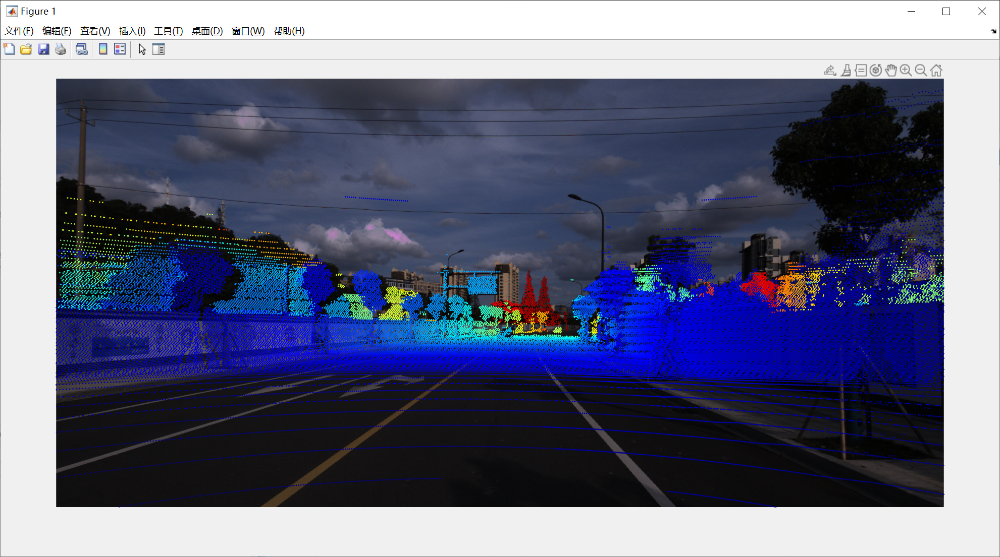

## 样例测试

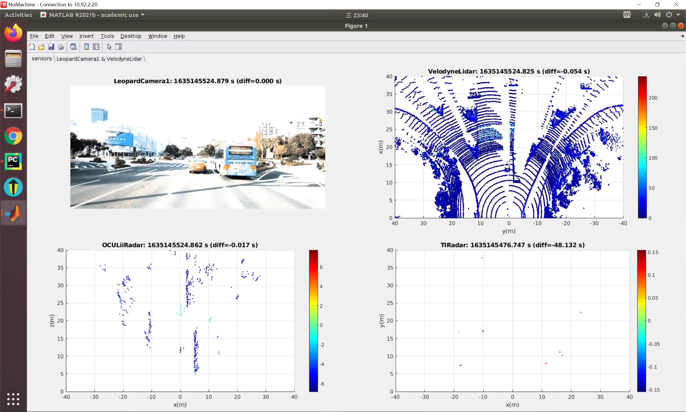

投影点云

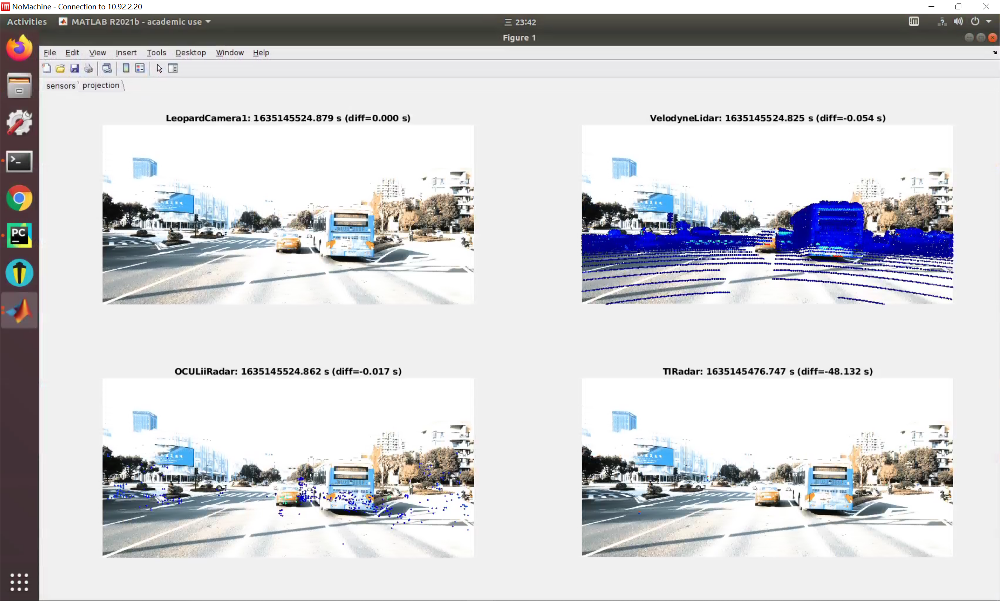

为VelodyneLidar自标注3d bbox后

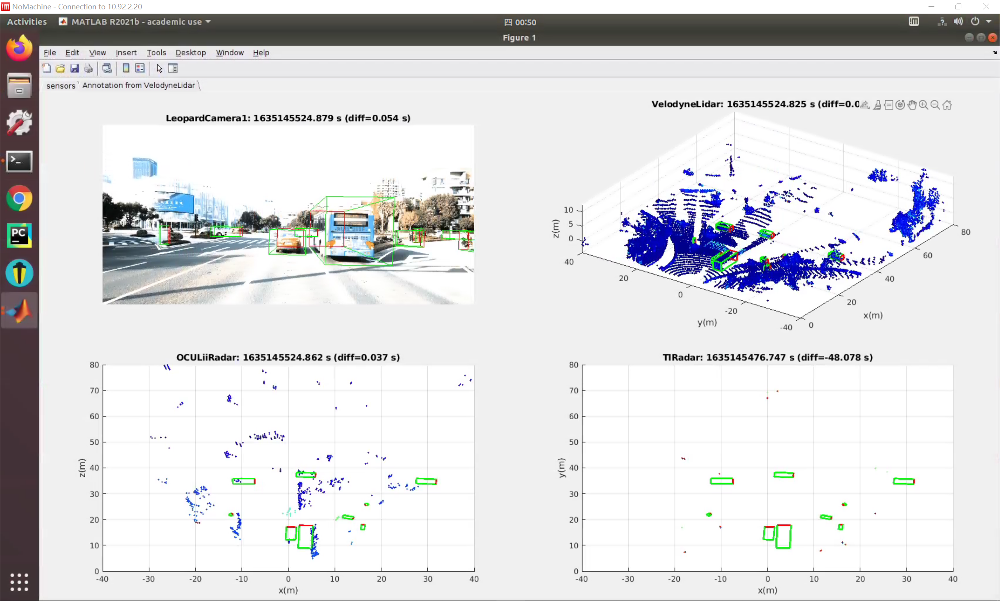